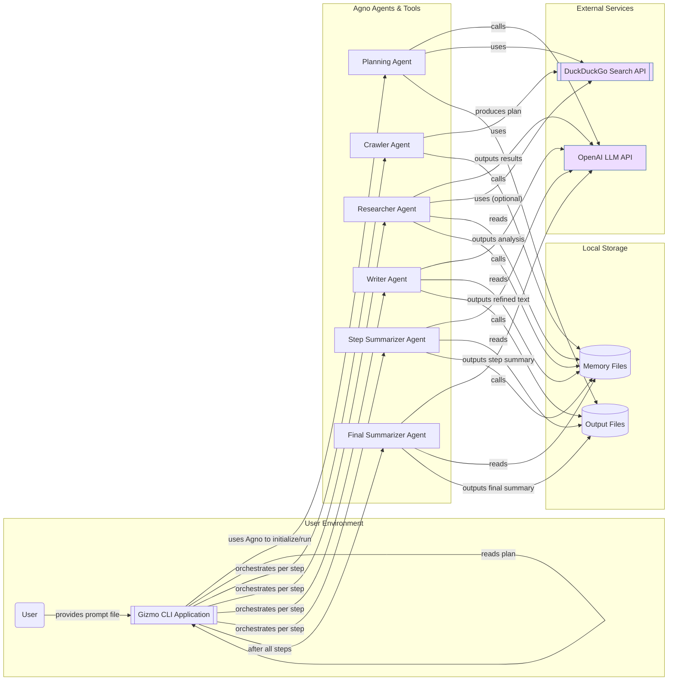
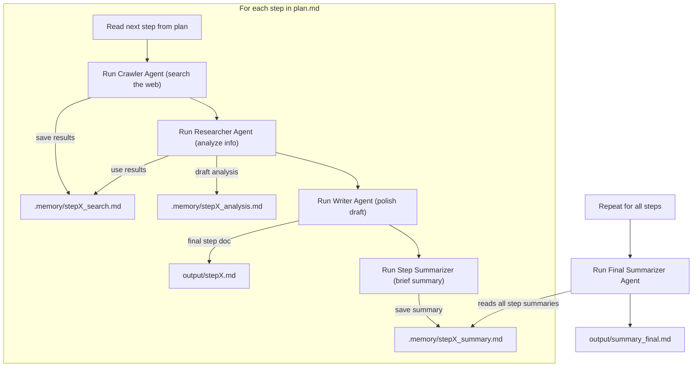

# Gizmo Research CLI – Technical Design Document

## Overview  
**Gizmo** is a modular Python console application (CLI) built on the **Agno** agent framework, designed as a research-focused alternative to Manus AI. Gizmo operates entirely via the command line (no GUI) and orchestrates multiple specialized agents to perform in-depth internet research. It supports two primary commands:  

- **`gizmo plan`** – Generates a research plan.  
- **`gizmo research`** – Executes the multi-agent research workflow based on a plan.  

In the **planning phase**, a single planning agent (powered by an LLM with internet access) analyzes the user’s input prompt and produces a Markdown-formatted plan (`plan.md`) listing all research steps or questions. In the **research phase**, Gizmo uses an Agno-based multi-agent pipeline to carry out each step: gathering information from the web, analyzing it, writing a detailed report, and summarizing results. All outputs are saved as Markdown files for easy reading and further processing. Gizmo is optimized for local use, emphasizing transparency (outputs are plain text files) and reproducibility of research.  

**Key Goals and Features:**  
- *Local CLI-Only Operation:* Gizmo runs in a terminal environment, reading prompts from files and writing results to disk (no web UI or GUI).  
- *Agno Framework Integration:* All agent logic and tool use leverage Agno’s lightweight, high-performance agent framework ([How to Build MultiModal AI Agents Using Agno Framework?](https://www.analyticsvidhya.com/blog/2025/03/agno-framework/#:~:text=,a%20specific%20provider%20or%20runtime)), ensuring efficient multi-agent orchestration.  
- *Modularity:* The codebase is organized into modules (planning, agents, workflow, etc.), allowing easy maintenance and extension of agent behaviors or tools.  
- *Reproducible Research Outputs:* Every stage produces a Markdown document (plan, step results, summaries) saved to the working directory for user inspection.  
- *Multi-Agent Workflow:* Specialized agents (crawler, researcher, writer, summarizers) collaborate in sequence, each focused on a specific task, which improves clarity and minimizes error propagation ([The Hidden Challenges of Multi-LLM Agent Collaboration | by Kye Gomez | Medium](https://medium.com/@kyeg/the-hidden-challenges-of-multi-llm-agent-collaboration-59c83f347503#:~:text=%E2%80%A2%20Task%20Assignment%20Confusion%3A%20If,or%20miss%20key%20tasks%20altogether)) ([The Hidden Challenges of Multi-LLM Agent Collaboration | by Kye Gomez | Medium](https://medium.com/@kyeg/the-hidden-challenges-of-multi-llm-agent-collaboration-59c83f347503#:~:text=%E2%80%A2%20Clear%20Role%20Definitions%3A%20Ensure,overlapping%20role%20within%20the%20system)).  

## Directory Structure and File Layout  
Gizmo uses a clear separation between **memory files** (intermediate data) and **final output files**. By default, intermediate artifacts are stored under a hidden `.memory/` directory, and final research documents are stored in a specified output directory (or current directory if not provided). This structure ensures that users see polished results, while debug data is kept accessible but out of the way. 

**Recommended Directory Layout:**  
- **Project Code Structure:** (for reference)  
  - `gizmo/` – Application package (Python modules for CLI, agents, tools, etc.).  
    - `cli.py` – Entry point and command definitions (argument parsing for `plan` and `research`).  
    - `agents/` – Module defining each agent’s configuration (roles, prompts, tools).  
    - `workflow.py` – Orchestrates multi-agent execution (reading plan, looping through steps, calling agents).  
    - `utils/` – Helper functions (file I/O, error handling, caching utilities, etc.).  

- **Working Directory (during execution):**  
  - `./.memory/` – **Intermediate memory files** (one sub-file per step/agent as needed, primarily for internal use and troubleshooting).  
    - e.g. `step1_search.md` (raw search results from crawler agent for step 1),  
         `step1_analysis.md` (researcher’s detailed findings for step 1),  
         `step1_summary.md` (step 1 summary by summarizer-step agent), etc.  
    - These files can be organized per step (e.g. prefixed with step number) to keep a logical order. Optionally, use subfolders per step: `./.memory/step1/…` for better grouping if many files are generated.  
  - `./output/` (or user-specified output dir) – **Final output files** produced for the user. This typically includes:  
    - `plan.md` – The research plan generated by `gizmo plan` (if the user directs it here).  
    - `step1.md, step2.md, ...` – Polished write-ups for each research step (output of the writer agent for each step). These are the primary detailed documents addressing each sub-question.  
    - `summary_final.md` – The final summary covering all research steps (output of the final summarizer agent).  
    - (Optionally, if desired, step-wise summary files can be saved here as well, e.g. `step1_brief.md` for the step’s summary. However, by default these brief step summaries may remain in `.memory/` unless the user wants them exported.)  

All files are Markdown-formatted for easy reading. The use of a hidden folder for memory ensures that only final deliverables appear in the main output directory, while still retaining all intermediate data for transparency or debugging. Table 1 below summarizes the typical files produced in a Gizmo session:

| **File/Directory**       | **Description**                                         |
|--------------------------|---------------------------------------------------------|
| `./.memory/`             | Directory for intermediate data (“agent memory”).       |
| `./.memory/stepX_search.md`   | Raw search results gathered by the crawler for step X.   |
| `./.memory/stepX_analysis.md` | Researcher agent’s detailed notes/analysis for step X.   |
| `./.memory/stepX_summary.md`  | Summary of step X’s findings (by summarizer-step agent). |
| `./output/`              | Directory for final output documents (user-facing).     |
| `./output/plan.md`       | Research plan (list of steps) generated from prompt.    |
| `./output/stepX.md`      | Polished report for step X (writer agent’s output).     |
| `./output/summary_final.md` | Overall summary of all research (final summarizer output). |

**Note:** All file paths can be configured via CLI options (`-o` paths). The above is the default convention for clarity. The `.memory` folder can grow with large research tasks, so it may be periodically cleaned or compressed by the user if needed. However, it is invaluable for reviewing how each agent reached its output (facilitating traceability of the research process).

## System Architecture and Agno Integration  
Gizmo’s architecture follows a **modular, layered design** leveraging Agno’s agent framework at its core. The CLI orchestrates high-level flows (planning vs. research), while Agno agents handle the intelligence and external interactions (web searches, content generation). The diagram below illustrates the major components and data flows in the system:



**Components:**  
- **CLI Layer:** The `gizmo` CLI (inside `cli.py`) parses user commands and arguments. It reads input prompt files and invokes the appropriate workflow. The CLI is responsible for initiating agents and passing data between steps, but it delegates all “intelligent” operations to the Agno agents. It also handles file I/O – saving the plan and results to disk (writing Markdown outputs, creating the `.memory` folder, etc.). This layer uses Python’s `argparse` or Click library to implement subcommands (`plan`, `research`).  

- **Agno Agents:** Each major task is handled by an agent defined via the Agno framework. Agno provides a lightweight interface to define agents with specific roles, prompts, and tools. In Gizmo, we define several specialized agents (planning agent, crawler, researcher, writer, summarizers). These agents are essentially orchestrators of OpenAI’s LLMs with specific instructions and tool access. Agno enables agents to use tools like web search or file access during their reasoning process. By constructing the workflow as a sequence of these agents, Gizmo benefits from Agno’s multi-agent coordination capabilities ([GitHub - agno-agi/agno: Lightweight framework for building Agents with memory, knowledge, tools and reasoning.](https://github.com/agno-agi/agno#:~:text=,term%20memory%20with%20our%20%60Storage)) while keeping each agent’s scope focused (this aligns with best practices of clear role definitions to prevent inter-agent confusion ([The Hidden Challenges of Multi-LLM Agent Collaboration | by Kye Gomez | Medium](https://medium.com/@kyeg/the-hidden-challenges-of-multi-llm-agent-collaboration-59c83f347503#:~:text=%E2%80%A2%20Clear%20Role%20Definitions%3A%20Ensure,overlapping%20role%20within%20the%20system))).  

- **External Services (Tools & Models):** Gizmo agents interact with external systems through defined tools:  
  - *DuckDuckGo API* for web searching – used by the **crawler** agent (and others when needed) to fetch live information from the internet. This does not require an API key and ensures broad coverage of the web.  
  - *OpenAI LLM API* for language reasoning – used by most agents to generate text (planning, analysis, writing, summarizing). Different OpenAI models (e.g., GPT-4, GPT-3.5 Turbo) are chosen for different agents depending on the task requirements (detailed rationale in [**Agent Models**](#agent-models-and-rationale) below).  
  - *File system* – Agents may also read from or write to local files (through the CLI or via tools) to persist intermediate results. For example, the researcher agent might read the crawler’s output file to incorporate that information, and writer agent reads the researcher’s notes. This could be done by passing the content into the prompt or via an Agno file-read tool if available.  

- **Storage:** Gizmo uses the local disk for both transient memory and final output, as described in the directory layout. Agents themselves could also use in-memory state or vector memory via Agno if needed, but in our design, simply writing to and reading from Markdown files suffices for maintaining continuity between steps. This approach makes the process transparent (the intermediate files serve as a trace of agent outputs). The `.memory` directory is akin to the application’s memory/knowledge base for the current research session, while the `output` directory holds the polished artifacts for the end-user.  

**Integration with Agno:** Gizmo is built “entirely on Agno,” meaning we use Agno’s classes and patterns to define and run each agent. Each agent is an instance of `agno.agent.Agent` configured with a model and toolset suitable for its task. By leveraging Agno’s multi-agent orchestration, we can chain agents together. Agno supports different collaboration modes (e.g., route vs. collaborate vs. coordinate ([GitHub - agno-agi/agno: Lightweight framework for building Agents with memory, knowledge, tools and reasoning.](https://github.com/agno-agi/agno#:~:text=,term%20memory%20with%20our%20%60Storage))); in Gizmo’s case, the workflow is primarily a **routed sequence** (each agent’s output feeds into the next agent in a predetermined order). The CLI code explicitly coordinates this sequence for clarity and flexibility (e.g., looping through plan steps, handling errors between agents). We do not use a single static `Agent(team=[...])` for the whole pipeline because each step of research may require dynamic inputs (specific query terms from the plan, and passing file contents between agents). Instead, the CLI iteratively invokes individual agent instances per step, which results in the same multi-agent collaboration outcome, but under finer programmatic control. This design choice makes it easier to implement custom logic at the transition of each step (such as retries or conditional skips on failure). 

**Modularity:** Each agent’s definition is encapsulated (e.g., in `agents/crawler_agent.py`, `agents/researcher_agent.py`, etc.), and the CLI/workflow orchestrator imports and uses them. This modular approach means new tools or agent types can be added without altering the core loop, and different models can be slotted in by changing configuration. The Agno framework’s model-agnostic nature ([How to Build MultiModal AI Agents Using Agno Framework?](https://www.analyticsvidhya.com/blog/2025/03/agno-framework/#:~:text=up%20to%20work%20seamlessly%20with,a%20specific%20provider%20or%20runtime)) also means we could substitute OpenAI models with others (Anthropic Claude, open-source LLMs, etc.) if needed, by changing the agent initialization parameters, without changing the agent logic.

## Agent Definitions and Roles  
Gizmo deploys a **team of specialized agents**, each with a distinct role in the research process. All agents are defined in Agno’s format, specifying their role (behavior profile), the model to use, and any tools they can call. This clear division of labor follows the principle of *separation of concerns*, reducing complexity and preventing the chain reaction of errors (i.e., an error in one agent is localized and can be caught before it propagates ([The Hidden Challenges of Multi-LLM Agent Collaboration | by Kye Gomez | Medium](https://medium.com/@kyeg/the-hidden-challenges-of-multi-llm-agent-collaboration-59c83f347503#:~:text=%E2%80%A2%20Task%20Assignment%20Confusion%3A%20If,or%20miss%20key%20tasks%20altogether))). Below are the agent roles and their configurations:

### 1. Planning Agent (`plan` command)  
**Role:** The planner is responsible for analyzing the initial research prompt and breaking it down into a structured plan. It outputs a **Markdown list of research questions or steps** that comprehensively address the prompt. Essentially, this agent decides *what needs to be researched* before any actual research is done.  

- **Model:** *OpenAI GPT-4 (reasoning model)* – Chosen for its superior reasoning and planning abilities. Planning often requires understanding complex queries and decomposing them; GPT-4’s larger context window and more advanced reasoning ensure a higher quality plan (fewer omissions, more logical ordering of steps) compared to smaller models.  
- **Tools:** Internet search (DuckDuckGo). The planning agent may use a quick web query to get a sense of the topic if the prompt is broad or unclear, ensuring it hasn’t missed any major subtopic. However, its primary output (the plan) is derived from reasoning, so minimal tool use is expected.  
- **Agno Definition:** A single-agent (not part of a team) run. It uses a reasoning model without persistent memory, just the prompt. For example, in code it might be defined as:  

  ```python
  from agno.agent import Agent
  from agno.models.openai import OpenAIChat
  from agno.tools.duckduckgo import DuckDuckGoTools

  plan_agent = Agent(
      name="Planning Agent",
      role="Research Planner",
      model=OpenAIChat(id="gpt-4o"),  # use GPT-4 via OpenAIChat
      tools=[DuckDuckGoTools()],     # allows web search if needed
      instructions=(
          "Analyze the user's research query and devise a structured plan.\n"
          "Break the problem into clear, answerable research questions or steps.\n"
          "Output the plan as a numbered list of steps in Markdown."
      ),
      markdown=True
  )
  ```  

  The instructions prompt the agent to produce a list of steps. The output will be saved as `plan.md`. (The `DuckDuckGoTools` can be invoked by the agent if it decides to search for an overview of the topic, but it will not perform the actual research – just planning.)

### 2. Crawler Agent (Web Search Agent)  
**Role:** The crawler’s job is to fetch information from the web relevant to a given research step. It takes one step (question) from the plan and uses a search engine to retrieve results (snippets or pages) that contain the information needed. This agent **does not perform complex reasoning** or summarization – it simply finds and returns raw data for the researcher to analyze. Think of it as an information scout.  

- **Model:** *OpenAI GPT-3.5 Turbo (or similar)* – We designate GPT-3.5 for this agent primarily to formulate the search query and possibly select which results to return. However, an important design note is that heavy LLM reasoning is not needed; the agent might even be configured in a minimal way (no chain-of-thought). It could use a template to directly call the search API and compile results. GPT-3.5 is chosen for speed and cost-efficiency here – it’s capable enough to parse the step question and turn it into effective search queries, but using GPT-4 here would be overkill. If desired, the crawler agent could even be implemented without an LLM (just using the DuckDuckGo library directly), since its task is straightforward. We keep it as an Agno agent for consistency, but mark it as a **Level 1 agent (tool use, minimal reasoning)** ([GitHub - agno-agi/agno: Lightweight framework for building Agents with memory, knowledge, tools and reasoning.](https://github.com/agno-agi/agno#:~:text=,agents%20collaborating%20on%20complex%20workflows)).  
- **Tools:** *DuckDuckGo web search.* This is the primary tool; the agent will issue a search query and retrieve top results. Optionally, the agent might have an HTTP retrieval tool to fetch the text of a top result if needed, but to keep things simple and fast, the crawler might just return the search snippets and links. The idea is to gather enough reference material for the researcher agent to work with.  
- **Agno Definition:** An agent with search capability and a simple instruction. For example:  

  ```python
  from agno.agent import Agent
  from agno.models.openai import OpenAIChat
  from agno.tools.duckduckgo import DuckDuckGoTools

  crawler_agent = Agent(
      name="Crawler",
      role="Web Searcher",
      model=OpenAIChat(id="gpt-3.5-turbo"),  # faster, cheaper model
      tools=[DuckDuckGoTools()],
      instructions=(
          "Use DuckDuckGo to search for information on the given topic.\n"
          "Return the most relevant results (with brief snippets) that relate to the query."
      ),
      markdown=True,
      show_tool_calls=False  # we might disable verbose tool usage logs in output
  )
  ```  

  In practice, the CLI will pass the specific step’s question as the input when running this agent. The agent (through Agno’s tool interface) will execute a search and output a Markdown list or text of results. This is saved to `.memory/stepX_search.md`. An example of the crawler’s output might be a list of URLs or summary snippets. (This is similar to the Agno “Web Agent” example using DuckDuckGoTools ([How to Build MultiModal AI Agents Using Agno Framework?](https://www.analyticsvidhya.com/blog/2025/03/agno-framework/#:~:text=web_agent%20%3D%20Agent%28%20name%3D,show_tool_calls%3DTrue%2C%20markdown%3DTrue%2C)), but focused on just retrieving data without additional commentary.)  

### 3. Researcher Agent (Analyst)  
**Role:** The researcher is the core **reasoning agent** that takes the raw info from the crawler and produces an in-depth analysis or explanation for that step. It reads the question (step description) and the reference material (search results, possibly full web pages or summaries) and then composes a detailed Markdown document answering the question or fulfilling the task of that step. This agent may perform additional searches or lookups as needed (it has the freedom to use tools to dig deeper), and it uses its LLM capabilities to synthesize information, draw conclusions, and ensure the answer is accurate and comprehensive. Essentially, the researcher acts like an expert analyst who uses both the retrieved data and its own knowledge.  

- **Model:** *OpenAI GPT-4 (or GPT-4-32k if long context required).* We use GPT-4 here for its strong reasoning, ability to handle nuance, and larger context window – important because the agent might need to juggle multiple pieces of information and possibly large text excerpts from sources. The researcher agent might receive several paragraphs of raw data from the crawler; GPT-4’s capacity helps it incorporate all relevant details without losing track. This agent is where the most “intelligence” is needed: combining facts, resolving contradictions, and giving a coherent answer. If GPT-4 with 32k context is available, it is ideal for handling many sources at once. GPT-3.5 could struggle here, which is why GPT-4 is recommended for the researcher despite its higher cost.  
- **Tools:** *DuckDuckGo (web search) and File I/O.* The researcher has a broader toolset:
  - It can use DuckDuckGo to perform follow-up searches if the initial info is insufficient or raises more questions. For example, if the plan step is “Explain the historical significance of the Eiffel Tower” and the crawler provided some basic facts, the researcher might autonomously search for specific dates or events if needed.  
  - It can read files from the `.memory` (specifically, the crawler’s output file for that step, and potentially any prior step outputs if cross-referencing is desired). In Agno, this might be done by simply including the text in the prompt or by a custom tool that reads a file. For instance, we might feed the content of `stepX_search.md` into the researcher’s prompt as context. If the content is too large, the researcher could summarize it first or ask the crawler to narrow it, but typically search results are brief.  
  - Optionally, a “browser” tool could fetch the actual webpage content from a URL if deeper reading is required. Agno doesn’t list an out-of-the-box HTTP fetch in the snippet we saw, but one could be implemented or the agent could use Python requests (via a custom tool) if needed. This is an advanced capability: e.g., if a search result snippet isn’t enough, the researcher agent might say “open the first link for details” and then parse the page. However, to keep things simpler, our initial design might skip full page retrieval unless absolutely necessary, relying on the search snippets plus the model’s own knowledge base.  
- **Agno Definition:** A reasoning agent with tools. For example:  

  ```python
  from agno.agent import Agent
  from agno.models.openai import OpenAIChat

  researcher_agent = Agent(
      name="Researcher",
      role="Analyst",
      model=OpenAIChat(id="gpt-4o"),  # advanced reasoning model
      tools=[DuckDuckGoTools()],     # can search the web further
      instructions=(
          "You are a research analyst. Using the reference information provided and any necessary web searches, "
          "write a detailed, well-structured answer for the topic/question given. "
          "Cite facts as needed and ensure the answer is comprehensive."
      ),
      markdown=True,
      show_tool_calls=True  # can be true during development to see if it searches
  )
  ```  

  Before running this agent, the CLI will prepare its input. Typically, the input includes the specific step’s text (e.g., “**Step 3:** Explain the historical significance of the Eiffel Tower”) along with an **appendix of reference data** – e.g., the content from `step3_search.md` (the crawler results for that step). The prompt template might look like:  

  *System Message/Instructions:* (as above, telling it to use references and be detailed)  
  *User Message:* The step’s question and the reference info, for example:  
  ```markdown
  **User Question:** Explain the historical significance of the Eiffel Tower.  
  **Reference Info:** (search snippets or notes from `.memory/step3_search.md`)
  - "Eiffel Tower was built in 1889 for the World's Fair..."  
  - "It has since become a global cultural icon of France and one of the most recognizable structures..."  
  *(and so on with key points from sources)*  
  ```  
  The researcher agent would then produce a detailed markdown answer, perhaps with sections or bullet points as appropriate. This output is saved as `.memory/step3_analysis.md` (or directly as a draft to be refined).  

  *Note:* The researcher is allowed to reason and even to perform multi-step thinking (potentially using Agno’s built-in reasoning tools like `ReasoningTools(add_instructions=True)` if we want it to explicitly do chain-of-thought). By giving it internet access within its prompt, we empower it to fetch any missing info (this uses the ReAct pattern where the LLM decides when to invoke a tool) ([GitHub - agno-agi/agno: Lightweight framework for building Agents with memory, knowledge, tools and reasoning.](https://github.com/agno-agi/agno#:~:text=This%20basic%20agent%20will%20obviously,tool%20to%20search%20the%20web)) ([GitHub - agno-agi/agno: Lightweight framework for building Agents with memory, knowledge, tools and reasoning.](https://github.com/agno-agi/agno#:~:text=match%20at%20L356%20tools%3D,stock_price%3DTrue)). This makes the researcher robust but also means it’s doing the heavy lifting in terms of API usage (multiple OpenAI calls if it thinks step-by-step). We accept this trade-off for completeness of research.  

### 4. Writer Agent (Stylistic Rewriter)  
**Role:** The writer agent takes the researcher’s output (which may be informative but could be raw or not perfectly structured for presentation) and rewrites or polishes it for clarity, style, and coherence. This agent is *not meant to add new information*; it focuses on language quality: ensuring the text flows well, is in a consistent tone, properly formatted in Markdown (using headings, lists, tables if needed), and free of redundancy. It essentially produces the final user-facing document for that step’s research findings. This separation allows the researcher to concentrate on content and facts, while the writer ensures readability and proper formatting.  

- **Model:** *OpenAI GPT-3.5 Turbo.* This task is well-suited for GPT-3.5, as it requires paraphrasing and editing rather than deep reasoning. GPT-3.5 is typically very capable at rewriting text, and using it here saves cost and time. We do not need the full power of GPT-4 for style adjustments (unless the content is extremely complex, but even then, the heavy analysis was already done by the researcher). The writer agent can be considered a *non-reasoning transform agent* – it takes an input text and produces an output text under given style guidelines.  
- **Tools:** None (no external tools). The writer does not need web access or file system tools beyond receiving the text to rewrite. It operates solely on the provided draft content.  
- **Agno Definition:** An agent with no tools, just a prompt instructing it how to rewrite. For example:  

  ```python
  writer_agent = Agent(
      name="Writer",
      role="Refiner",
      model=OpenAIChat(id="gpt-3.5-turbo"),
      tools=[],  # no external tools needed
      instructions=(
          "You are a technical writer. Rewrite and polish the given content into a clear, well-structured Markdown document. "
          "Improve fluency and fix any grammatical issues, but do not change factual content. Use headings, bullet points, or tables where appropriate to enhance readability."
      ),
      markdown=True
  )
  ```  

  The input to this agent is the raw analysis text from the researcher (from `.memory/stepX_analysis.md`). The output will be a refined version saved as the final `stepX.md` in the output directory. For instance, if the researcher’s draft had a somewhat disorganized structure, the writer might re-section it with proper Markdown headings, add an introduction or conclusion if missing, and ensure consistent tone. The result is the polished research document for that step.  

### 5. Step Summarizer Agent (Per-Step Summary)  
**Role:** After each step’s detailed report is written, the step summarizer produces a **concise summary** of that step’s findings. This could be a few sentences or bullet points highlighting the key insight from that step. The purpose is twofold: (1) To provide a quick reference or executive summary for the user per step, and (2) to feed into the final summarizer agent later. By summarizing each step immediately, we reduce the amount of text that must be considered when creating the final summary, which is important for token limits and focus ([LLM Agent SOS: Best Practices and Considerations for Implementation | by Rajat Nigam | Medium](https://rajatnigam89.medium.com/llm-agent-sos-best-practices-and-considerations-for-implementation-90bda9583cba#:~:text=Managing%20Context%20Window%20Constraints)).  

- **Model:** *OpenAI GPT-3.5 Turbo.* Summarization of a single step’s content (which after the writer’s polish might be a few hundred words or a couple of pages at most) is a relatively contained task. GPT-3.5 is usually very competent at summarizing and can do it quickly. We prioritize speed here, as this will run for each step. If the content is extremely technical or lengthy, GPT-4 could yield a slightly better summary, but given each step is a manageable size and we want to conserve resources for the final summary, GPT-3.5 is sufficient.  
- **Tools:** None (just like the writer, it only needs the text given).  
- **Agno Definition:** Another tool-less agent with a simple instruction to summarize. For example:  

  ```python
  summarizer_step_agent = Agent(
      name="Step Summarizer",
      role="Summarizer",
      model=OpenAIChat(id="gpt-3.5-turbo"),
      tools=[],
      instructions=(
          "Summarize the following text in a few sentences, capturing the main point and any important findings. "
          "Be concise and clear."
      ),
      markdown=True
  )
  ```  

  The input is the content of `stepX.md` (the polished report). The output is a brief summary (saved to `.memory/stepX_summary.md`). For example, if step X was about the Eiffel Tower’s history, the summary might say: “**Summary (Step X):** The Eiffel Tower, built in 1889 for the Paris World’s Fair, symbolized industrial progress. Originally intended to be temporary, it became a lasting landmark and icon of France. Over the years it has served as a radio transmitter and a tourist attraction, illustrating France’s cultural and technological history.” – Just a short paragraph encapsulating the step.  

### 6. Final Summarizer Agent (Overall Summary)  
**Role:** This agent generates a **final summary of the entire research project**, providing the user with an overarching synthesis of all the findings. It should combine the key points from each step into a coherent summary that addresses the original prompt at a high level. Essentially, it answers: “What have we learned from all these steps?” in a concise way. This final summary is useful as an executive overview or conclusion.  

- **Model:** *OpenAI GPT-4 (if available, else GPT-3.5 with caution).* The final summarizer deals with the aggregated information of all steps. If the research involved many steps, the combined data is large – even if we only feed in the step summaries, it could be substantial. GPT-4’s larger context handling (especially if using 8k or 32k token versions) and better abstraction abilities make it ideal for producing a well-rounded summary that doesn’t miss nuances. We prefer GPT-4 to ensure the summary integrates information accurately from across different subtopics. However, if resource constraints are an issue, GPT-3.5 could be used with a risk of losing some detail. For a high-quality final result, GPT-4 is recommended for this agent.  
- **Tools:** None (it works purely on text given – the step summaries). It doesn’t need to search the web; it’s summarizing what’s already been found.  
- **Agno Definition:** A final agent with instructions to synthesize summaries. For example:  

  ```python
  summarizer_final_agent = Agent(
      name="Final Summarizer",
      role="Synthesizer",
      model=OpenAIChat(id="gpt-4o"),
      tools=[],
      instructions=(
          "Given the summaries of each step of the research, produce an overall summary of the findings. "
          "This summary should address the original query broadly and highlight key insights from each part of the research. "
          "Keep it concise and well-structured (you may use bullet points for separate themes if necessary)."
      ),
      markdown=True
  )
  ```  

  The input to the final summarizer is typically a concatenation of all step summaries (from `.memory/step1_summary.md`, `.memory/step2_summary.md`, …) possibly preceded by a note about the original research goal. Because each step summary is already relatively short, the final agent can handle them more easily (this strategy is effectively *hierarchical summarization* to deal with token limits ([LLM Agent SOS: Best Practices and Considerations for Implementation | by Rajat Nigam | Medium](https://rajatnigam89.medium.com/llm-agent-sos-best-practices-and-considerations-for-implementation-90bda9583cba#:~:text=Managing%20Context%20Window%20Constraints)) ([LLM Agent SOS: Best Practices and Considerations for Implementation | by Rajat Nigam | Medium](https://rajatnigam89.medium.com/llm-agent-sos-best-practices-and-considerations-for-implementation-90bda9583cba#:~:text=In%20agent,also%20enhances%20the%20user%20experience))). The output is saved as `summary_final.md`. For instance, a final summary might be a few paragraphs outlining each major finding and concluding statement answering the main question or offering an insight gleaned from the whole research.  

**Summary of Agents and Configurations:** The table below recaps the agents, their model choices, and tool access for quick reference:

| **Agent**           | **Purpose/Role**         | **Model (LLM)**         | **Tools**                     | **Output**                   |
|---------------------|--------------------------|-------------------------|-------------------------------|------------------------------|
| **Planning Agent**  | Analyze user prompt, devise research plan (steps/questions). | GPT-4 (strong reasoning)    | DuckDuckGo Search            | `plan.md` (Markdown list of steps) |
| **Crawler Agent**   | Retrieve relevant information for a given step (search results). | GPT-3.5 (minimal reasoning) | DuckDuckGo Search            | `.memory/stepX_search.md` (raw results) |
| **Researcher Agent**| In-depth research and analysis for the step using references. | GPT-4 (detailed reasoning)  | DuckDuckGo Search, File Read | `.memory/stepX_analysis.md` (detailed draft) |
| **Writer Agent**    | Refine and format the research draft into polished prose. | GPT-3.5 (language polish)   | *(none)*                     | `output/stepX.md` (final step report) |
| **Step Summarizer** | Summarize the step’s report into key points. | GPT-3.5 (summarization)     | *(none)*                     | `.memory/stepX_summary.md` (step summary) |
| **Final Summarizer**| Synthesize all step summaries into an overall summary. | GPT-4 (for synthesis)       | *(none)*                     | `output/summary_final.md` (final summary) |

Each agent is defined with clear instructions aligning to its role. The use of GPT-4 vs GPT-3.5 is balanced to optimize both quality and cost: heavy reasoning stages use the more powerful model, whereas stylistic or repetitive tasks use the faster, cheaper model. All agents output Markdown content to ensure consistency in formatting (they are instructed accordingly with `markdown=True` and via their prompt instructions).

## Prompt Templates and Instructions per Agent  
Careful prompt design is crucial to guide each agent to perform its role effectively. Gizmo uses templated prompts (possibly with system and user message separation as per OpenAI Chat completions) for each agent, embedding any necessary context (like reference text) and instructions. Below we outline the core prompt content for each agent type:

- **Planning Agent Prompt:** This agent’s prompt includes the **user’s initial query or topic description** (from the input file provided via `-i` to `gizmo plan`) and explicit instructions to create a plan. For example:  

  **System message:** “You are an expert research planner. Your task is to break down the user’s request into a series of research steps or questions that, when answered, will comprehensively address the request. Each step should be clear, focused, and logically ordered.”  

  **User message:** The content of the input prompt file (e.g., “Analyze the impact of climate change on global agriculture and propose mitigation strategies.”). Possibly followed by: “Outline a plan for researching this topic.”  

  The agent then returns a numbered list in Markdown. Example output snippet:  
  ```markdown
  1. **Historical Climate Data and Trends** – Gather data on how climate patterns have changed in agricultural regions over the past decades.  
  2. **Effects on Crop Yields** – Investigate documented impacts of climate change on crop productivity (droughts, floods, shifting growing seasons).  
  3. **Socio-Economic Impact** – Explore how these yield changes affect farmers and food supply (economy, food security).  
  4. **Mitigation Techniques** – Identify strategies (e.g., drought-resistant crops, farming practices) to mitigate negative effects.  
  5. **Case Studies** – Examine specific examples of regions successfully adapting or struggling.  
  ```  
  This would be saved as `plan.md`. The planning agent’s prompt encourages breaking tasks into manageable sub-tasks ([The Hidden Challenges of Multi-LLM Agent Collaboration | by Kye Gomez | Medium](https://medium.com/@kyeg/the-hidden-challenges-of-multi-llm-agent-collaboration-59c83f347503#:~:text=%E2%80%A2%20Standardizing%20Prompt%20Engineering%3A%20Developing,effective%20prompts%20across%20all%20agents)) (multi-step prompting).  

- **Crawler Agent Prompt:** For each step, the CLI generates a prompt for the crawler. It might embed the step description in a sentence instructing a search. For instance, if step 2 is “Effects on Crop Yields – investigate impacts on crop productivity”, the prompt could be:  

  **System/Instruction:** “You are a web search agent. Search the web for information relevant to the following query and provide the top results with brief descriptions.”  

  **User message:** “Effects of climate change on crop yields global agriculture.” (A succinct query derived from the plan step – the agent or the CLI may rephrase the step into a query.)  

  The crawler agent will then call the DuckDuckGo tool internally. We expect its final answer to be something like a list of bullet points or short paragraphs, for example:  
  ```markdown
  - **Result 1:** *Climate Change Impact on Agriculture* – An FAO report detailing observed changes in crop yields worldwide【source1】.  
  - **Result 2:** *Droughts reducing crop production* – News article about recent droughts in wheat-producing regions【source2】.  
  - **Result 3:** *Crop Adaptation Strategies* – Research paper discussing breeding of heat-resistant crop varieties【source3】.  
  ```  
  (It might include the URLs or titles from DuckDuckGo results; we would capture whatever it returns.) The prompt doesn’t require the agent to formulate a narrative, just to fetch results, so it’s kept minimal.  

- **Researcher Agent Prompt:** This is the most complex. The prompt will incorporate both the question and the references. We might structure it as:  

  **System message (instructions):** A detailed guideline as given in the agent definition, e.g.: *“You are a research analyst. Using the information provided and any additional web research, answer the question thoroughly. Provide context, explanations, and relevant facts. If sources are provided, integrate them. Do not just copy text; synthesize and explain in your own words. Aim to be comprehensive yet focus on the question.”* Also, we might instruct the agent to use Markdown headings or citations if needed (e.g., “Use markdown formatting; for any direct facts, you may cite as needed.”).  

  **User message:** This will contain the step question and the reference info. Possibly formatted like:  
  ```markdown
  **Research Question:** What are the documented effects of climate change on crop yields globally?  

  **Reference Materials:**  
  - [Result 1] "According to the FAO report, global crop yields for staples like wheat and maize are projected to drop by 10-25% by 2050 due to climate change."  
  - [Result 2] "A 2022 study in *Nature* found that every 1°C increase in global temperature could reduce overall crop yield by about 5%."  
  - [Result 3] "Some regions may experience initial gains (e.g., higher CO2 fertilization effect in temperate zones), but extreme weather events are causing net losses in productivity."  
  *(...)*  
  ```  
  The above reference snippet is constructed from the crawler’s results (which the CLI or the agent itself can refine). With this prompt, the researcher agent will produce a detailed answer, possibly with its own structure:  

  ```markdown
  **Impact of Climate Change on Crop Yields**  

  Climate change has a significant documented impact on global crop yields. Studies indicate that for each 1°C rise in temperature, major staple crop yields could decline by ~5%【source2】. Increased frequency of droughts and heatwaves under climate change has already led to notable production drops – for instance, recent wheat harvests were severely reduced in parts of Africa and Asia【source1】. While higher CO2 levels can stimulate plant growth (the CO2 fertilization effect), this benefit is often offset by extreme weather, shifting rainfall patterns, and increased pests. Some temperate regions might see short-term yield boosts, but overall the trend is negative.  

  *… (more detail and examples)*  
  ```  

  (Citations like 【source1】 refer to reference materials – the agent might include them if instructed, though managing actual reference URLs in output could be done by post-processing or by instructing the agent to output in a certain way.) The key is the prompt clearly provides context and expectations.  

- **Writer Agent Prompt:** The writer gets the full text from the researcher. The prompt likely doesn’t need the user message context beyond “Here is a draft to polish,” since it’s not question-answer form but a transformation. We can use the system role to instruct style: e.g.: *“You are an editor. Rewrite the following content to improve clarity and style. Maintain the meaning and keep all factual details, but make the writing more concise and well-organized.”* The content from the researcher is then included, possibly as a direct quote or just as is, under the user role. The model will then output a revised version. Because the writer’s task is straightforward, we expect it to follow instructions without needing a user question. The prompt structure can be simple:  

  **System message:** as above (editor instructions).  
  **User message:** The entire researcher draft text (could be prefaced with “Draft:” to avoid confusion).  

  The writer outputs the polished Markdown. We ensure to instruct it not to hallucinate new info, just rephrase.  

- **Step Summarizer Prompt:** This prompt is very straightforward: the input is the final step content, and we ask for a summary. E.g.: *“Summarize the following article in 2-3 sentences:”* followed by the text. Or we might say *“Briefly summarize the key findings of the above.”* Since this is done via the agent’s system instruction (as set in agent definition), the actual run might just feed the step text as the user message. The agent returns a concise summary.  

- **Final Summarizer Prompt:** Similar approach to step summarizer but with multiple inputs. We will provide a collated list of step summaries. Possibly format the user message like:  

  ```markdown
  **Step 1 Summary:** ...  
  **Step 2 Summary:** ...  
  **Step 3 Summary:** ...  
  *(and so on)*  
  ```  
  and then: *“Based on the above, provide an overall summary of the research findings.”* as the instruction. The final summarizer will then compose a cohesive summary. If needed, we can instruct it to ensure it mentions each major section or to frame it as an answer to the original prompt. (We may include the original prompt again for context.)  

All templates emphasize **clarity** and staying on task. We avoid overly vague prompts that could confuse the agent ([The Hidden Challenges of Multi-LLM Agent Collaboration | by Kye Gomez | Medium](https://medium.com/@kyeg/the-hidden-challenges-of-multi-llm-agent-collaboration-59c83f347503#:~:text=%E2%80%A2%20Incomplete%20or%20Vague%20Prompts%3A,often%20leading%20to%20incorrect%20decisions)) and instead use direct language about what to do. Each agent’s prompt is tailored to its capability: for example, we include “use the provided info” for the researcher to ground it in references (to mitigate hallucinations), and “do not change meaning” for the writer to avoid introducing errors. These prompt guidelines, combined with the role definitions in Agno, help maintain alignment and coherence across the multi-agent workflow.

## Workflow Orchestration (Agno Workflow Definition)  
The overall workflow is a **two-phase process**: planning, then research. The research phase itself loops through each planned step and invokes a mini-sequence of agents. We describe this in pseudocode and a flow diagram for clarity.

**Pseudocode for Gizmo Workflow:**

```python
def run_plan(input_prompt_path, output_plan_path):
    user_prompt = read_file(input_prompt_path)
    plan_agent = configure_plan_agent()  # as defined above
    plan_markdown = plan_agent.run(user_prompt)  # run the agent to get plan
    write_file(output_plan_path, plan_markdown)

def run_research(plan_path, output_dir):
    plan = parse_plan_file(plan_path)  # e.g., extract list of step descriptions
    ensure_dir(".memory")
    ensure_dir(output_dir)
    step_outputs = []  # to collect step summaries for final summarizer
    for i, step in enumerate(plan, start=1):
        # Crawler phase
        query = formulate_search_query(step)
        crawler = configure_crawler_agent()
        search_results = crawler.run(query)
        mem_path = f".memory/step{i}_search.md"
        write_file(mem_path, search_results)
        # Researcher phase
        researcher = configure_researcher_agent()
        # Combine step and search results as input
        researcher_input = f"Question: {step}\nReferences:\n{search_results}"
        analysis = researcher.run(researcher_input)
        write_file(f".memory/step{i}_analysis.md", analysis)
        # Writer phase
        writer = configure_writer_agent()
        polished = writer.run(analysis)
        output_path = os.path.join(output_dir, f"step{i}.md")
        write_file(output_path, polished)
        # Summarizer (step) phase
        step_summarizer = configure_step_summarizer_agent()
        summary = step_summarizer.run(polished)
        write_file(f".memory/step{i}_summary.md", summary)
        step_outputs.append(summary)
    # Final Summarizer phase
    final_summarizer = configure_final_summarizer_agent()
    all_summaries_text = "\n\n".join(step_outputs)
    final_summary = final_summarizer.run(all_summaries_text)
    write_file(os.path.join(output_dir, "summary_final.md"), final_summary)
```

In the above outline, `configure_*_agent()` refers to setting up the Agno `Agent` instances as described in the agent definitions. The actual code would handle exceptions and possibly streaming of output, but this demonstrates the logical sequence. The CLI commands `gizmo plan` would call `run_plan()`, and `gizmo research` would call `run_research()` accordingly.

**Workflow Diagram:** The following flowchart illustrates the sequence of operations in the research phase (after the plan is obtained):



In words: for each step, Gizmo searches the web (Crawler) -> analyzes content (Researcher) -> refines the write-up (Writer) -> summarizes the step (SummarizerStep). After all steps, the FinalSummarizer produces the overall summary. The plan itself is generated prior to this loop by the planning agent (not shown in this loop). The arrows in the diagram also indicate the hand-off of data via files: e.g., the crawler’s results are saved then read by the researcher; the researcher’s draft is saved then refined by the writer, etc.

This workflow corresponds to Agno’s **“team of agents” coordinated in sequence**, but implemented via explicit loop control. We could also conceptualize this in Agno’s declarative workflow style: a coordination of agents where the output of one is fed as input to the next. If Agno’s framework supports a pipeline mode (as implied by “route” mode ([GitHub - agno-agi/agno: Lightweight framework for building Agents with memory, knowledge, tools and reasoning.](https://github.com/agno-agi/agno#:~:text=,term%20memory%20with%20our%20%60Storage))), one could define a Team with `[Crawler, Researcher, Writer, SummStep]` as sub-agents and run that for each item. However, we have more control and error handling by doing it in Python code as above.

**Parallelization Consideration:** The design currently processes steps sequentially (one after another). This ensures we don’t overwhelm the system or hit rate limits easily and allows each step to use maximum context if needed (since we clear context each iteration). If research steps are independent, a potential future optimization could run some steps in parallel (e.g., spawn multiple threads or processes for different steps), especially if there are many steps. However, one must then be mindful of OpenAI API rate limits and increased memory usage. For now, sequential execution is safer and simpler.

## Error Handling and Recovery Strategies  
Robustness is vital in an autonomous multi-agent system – any failure in one stage can disrupt the entire workflow ([The Hidden Challenges of Multi-LLM Agent Collaboration | by Kye Gomez | Medium](https://medium.com/@kyeg/the-hidden-challenges-of-multi-llm-agent-collaboration-59c83f347503#:~:text=%E2%80%A2%20Error%20Propagation%3A%20A%20mistake,incorrect%20decisions%20by%20subsequent%20agents)). Gizmo incorporates error detection and recovery mechanisms at each stage to handle issues like network errors, missing information, or model failures. Below we outline strategies per stage:

- **Planning Stage Errors:** If the planning agent fails (e.g., API call error or it produces an incoherent plan), the CLI will catch the exception or validate the output. **Recovery:** Retry the planning agent call once or twice if an API error occurred (with a brief delay, in case of rate limiting). If the output is unintelligible or empty, Gizmo can log an error and abort gracefully (since without a plan we cannot proceed). As a fallback, it might return a single-step plan (just the original prompt as one step), essentially defaulting to directly researching the query if planning fails. This ensures the user still gets something, even if it’s not broken down.  

- **Crawler Stage Errors:** The crawler might face issues like no search results or network timeouts. **Recovery:** If no results are returned, the crawler agent (or the CLI wrapper) can modify the query and try again (e.g., relax the query terms, or use an alternative search tool if available). For instance, if searching “Crop yield climate change global” returns nothing (unlikely, but assume an edge case), it could try a simpler query like “Climate change crop yields”. We can also implement a fallback to another search engine tool (Agno has GoogleSearchTools as well ([How to Build MultiModal AI Agents Using Agno Framework?](https://www.analyticsvidhya.com/blog/2025/03/agno-framework/#:~:text=name%3D,show_tool_calls%3DTrue%2C%20markdown%3DTrue%2C))) if DuckDuckGo fails consistently. In case of a network failure, we attempt the search again after a short pause. If after a couple of tries the search fails, Gizmo will record a warning in the `.memory/stepX_search.md` (like “*(No search results could be retrieved for this query.)*”) so that the researcher agent is aware of the lack of external info and can either rely on prior knowledge or skip that step. The system then continues to the next step instead of halting completely.  

- **Researcher Stage Errors:** The researcher agent might run into:
  - *API errors or timeouts:* e.g., if GPT-4 call fails due to rate limit or an internal error. **Recovery:** Catch the exception and retry after a delay. Possibly break the input into smaller parts if token limit is an issue (though using step summaries and references should keep it within bounds). We maintain a count of retries to avoid infinite loops. If repeated failures occur, we log the step as failed.  
  - *Hallucinations or irrelevance:* If the researcher’s output seems off (e.g., answering the wrong question or including incorrect info), it’s harder to automatically detect. We can incorporate a simple validation: after the researcher outputs text, run a quick check if it actually contains keywords from the question or reference. If the output is too off-topic, we could retry the researcher agent with a more constrained prompt (perhaps prepend “Focus only on the question at hand: …” to the instructions). This is not foolproof but adds some robustness.  
  - *Excess length:* If the researcher produces an extremely long output that might overflow the writer or summarizer later, we could trim or summarize it before passing on. However, since the writer can handle polishing, we usually let the writer condense if needed.  

- **Writer Stage Errors:** Since the writer uses a fairly reliable model and just reformats text, errors here are less common. Potential issues:
  - *Loss of content:* The writer might accidentally omit a critical piece of information while rewriting. To mitigate this, we instruct it clearly not to remove factual content. We could also diff the input and output to ensure key terms from input appear in output. If something major is missing, we could either prompt the writer again more forcefully or decide to append the missing piece manually. This kind of semantic check is complex, so in a first iteration we might rely on spot checking or user review if needed.  
  - *Formatting issues:* If the output isn’t valid Markdown (e.g., forgot to close a code block), it’s a minor issue. We could have a post-process that fixes simple Markdown syntax issues or run a Markdown linter on the output. This ensures the final documents are well-formed.  
  - If the writer agent fails (API error), simply retry. If it consistently fails, as a last resort, we might bypass it and use the researcher’s draft as the final (with a warning that it’s unpolished).  

- **Summarizer Stages Errors:**  
  - The step summarizer might sometimes produce an inaccurate summary (especially if the step text is very complex). If the summary seems too short or too generic, we might attempt to regenerate it by providing more direct prompt, like explicitly saying “List 2 key points from the text.” We can also instruct it to include specific keywords to ensure it touches the main topics. However, given summarization is straightforward, this is rarely an issue.  
  - If an API error happens or the summary is empty, we can retry. If still failing, we can skip the summary for that step and just feed the full step text (or a manually truncated version) into the final summarizer. The system might log a message: “Step X summary not generated, using full text for final summary – may affect conciseness.”  
  - The final summarizer could fail if the combined summaries are too long (exceeding context). If using GPT-4 8k and we have more than that in summaries, we should instead feed it in parts. Our design of summarizing each step is intended to prevent this, but if the plan had, say, 50 steps each summarized to 200 tokens, that’s 10k tokens – slightly above 8k. In such a case, if 32k model is not available, we could have the final summarizer read in chunks (e.g., first summarize 1-25, then 26-50, then summarize those summaries). This is a more complex hierarchical approach. A simpler mitigation: instruct the step summarizer to be *very brief* (so each summary is, say, max 3 sentences). Also, we could drop less important details in the final summary (the final agent could be told to prioritize and not necessarily include every step if too many).  
  - If the final summarizer fails due to an API error, we retry. If it fails due to content (maybe it didn’t understand the compiled input), we can try reformatting the input (perhaps numbering the step summaries or providing the original prompt for context). Last resort, if final summary cannot be produced, the system can output a note in `summary_final.md` explaining that (though this would be a rare outcome).  

- **General Error Handling:** The CLI will be wrapped in try/except blocks to catch unexpected exceptions (like file I/O errors, etc.). If any agent throws an exception that isn’t handled internally, the CLI will capture it, log a message to stderr or a log file, and attempt to continue if possible (for example, skip the current step and move on). Throughout the run, Gizmo can accumulate warnings about any recoverable issues. At the end of the run, it can either display a summary of warnings or include them in an output file (maybe an `output/log.txt` or in the final summary markdown as an appendix). This way, the user or a developer knows if some steps might be incomplete or if some data was skipped.  

- **Interactive Recovery (future enhancement):** In a CLI context, we could also implement an interactive prompt on failure (e.g., “Crawler failed for step 3. Would you like to retry (r), skip (s), or abort (a)?”). By default, in automated mode, it would retry then skip with warning. But an advanced user could intervene. This is a design consideration for a later version to improve usability.

By implementing these strategies, we aim to make the multi-agent workflow resilient. Multi-agent systems can compound errors at each step ([LLM Agent SOS: Best Practices and Considerations for Implementation | by Rajat Nigam | Medium](https://rajatnigam89.medium.com/llm-agent-sos-best-practices-and-considerations-for-implementation-90bda9583cba#:~:text=Mitigating%20Hallucinations)) ([The Hidden Challenges of Multi-LLM Agent Collaboration | by Kye Gomez | Medium](https://medium.com/@kyeg/the-hidden-challenges-of-multi-llm-agent-collaboration-59c83f347503#:~:text=%E2%80%A2%20Error%20Propagation%3A%20A%20mistake,incorrect%20decisions%20by%20subsequent%20agents)), so catching and handling them locally is critical. For example, if the crawler fails but we let the researcher proceed with no info, the researcher might hallucinate an answer, leading to misinformation that the writer then dutifully polishes – a silent failure. Instead, our approach ensures that if the crawler fails, the researcher knows there's no data (and could either flag that or rely on general knowledge but with caution). Similarly, by having the writer and summarizer focusing on form and brevity, they are less likely to introduce errors, and any content issues ideally have been resolved by the researcher stage.

## Optimization Strategies for Long Sessions  
Research tasks can be lengthy (many steps, lots of data), so Gizmo incorporates optimizations to manage runtime, API usage, and resource limits:

- **Caching of Results:** To avoid redundant operations, Gizmo uses caching at multiple levels:
  - **Search Results Caching:** If two plan steps produce identical or very similar search queries, we can reuse the result from the first query instead of hitting the API again. For example, if step 4 and step 7 both needed information about “crop yield CO2 effect,” we detect this and skip a duplicate search. We can implement a simple cache (in memory or on disk) keyed by query string or a hash of it. DuckDuckGo results don’t change frequently in one session, so this can save time. As noted in best practices, caching frequently used data can **significantly reduce wait times and API calls ([LLM Agent SOS: Best Practices and Considerations for Implementation | by Rajat Nigam | Medium](https://rajatnigam89.medium.com/llm-agent-sos-best-practices-and-considerations-for-implementation-90bda9583cba#:~:text=In%20agent,also%20enhances%20the%20user%20experience))**.
  - **LLM Response Caching:** Similarly, although less common, if an agent is called with the exact same input again (perhaps due to a retry scenario or two steps being identical in content), we can cache the output of the first call. For instance, if the summarizer final is run twice on the same input (maybe due to a retry after failure), the second time we fetch the result from cache rather than calling the API again. This is easier if we give each prompt a deterministic ID and store outputs (perhaps using a simple JSON or a lightweight database). OpenAI’s responses might not be identical every time, but for idempotent tasks like summarization, using a cached answer is acceptable.  

- **Memory Management and Token Budgeting:** We carefully craft what information to feed into each agent to stay within token limits:
  - The **plan agent** only sees the user prompt (usually short) and maybe a bit of web info, so it’s fine.
  - The **crawler** deals with short queries and outputs small snippets.
  - The **researcher** is the most at-risk for context overload. We mitigate this by providing only the necessary references (top results) rather than entire articles. If the researcher decides to do more searching, it will do it stepwise (using tools) so at any given time, the prompt+tool output stays within manageable size. We also encourage summarization of input if needed via the instructions (like “using the information provided” implies it should use that rather than expecting more). Additionally, if the `.memory/stepX_search.md` is very large (say we allowed the crawler to retrieve a lot), the CLI could truncate or highlight the key parts before feeding to the researcher. This is a form of input preprocessing to avoid hitting context limits.  
  - The **writer** sees at most the researcher’s output. That could be several thousand tokens if the researcher was verbose. GPT-3.5 can handle up to 4k tokens input, which should be fine in most cases. If not, the researcher should have perhaps been instructed to keep it concise, or we could split the content and have the writer refine in parts (though that complicates coherence). It’s unlikely necessary if each step is a moderate scope.  
  - The **summarizer-step** only sees one step’s worth of content at a time, easily within limits.  
  - The **final summarizer** sees all step summaries. Our design ensures these summaries are much shorter than the full content. This hierarchical summarization is a known strategy to handle long texts ([AI’nt That Easy #2: 4 Approaches to Solve LLM Token Limit and Rate Limit Issues | by Aakriti Aggarwal | Medium](https://aakriti-aggarwal.medium.com/aint-that-easy-2-4-approaches-to-solve-llm-token-limit-and-rate-limit-issues-13cad16fa158#:~:text=Token%20limit%3A%20LLMs%20can%20only,1500%20words%20or%206%E2%80%938%20paragraphs)) ([AI’nt That Easy #2: 4 Approaches to Solve LLM Token Limit and Rate Limit Issues | by Aakriti Aggarwal | Medium](https://aakriti-aggarwal.medium.com/aint-that-easy-2-4-approaches-to-solve-llm-token-limit-and-rate-limit-issues-13cad16fa158#:~:text=1)). We thereby **focus the information within the context window** on the most relevant data ([LLM Agent SOS: Best Practices and Considerations for Implementation | by Rajat Nigam | Medium](https://rajatnigam89.medium.com/llm-agent-sos-best-practices-and-considerations-for-implementation-90bda9583cba#:~:text=For%20every%20reasoning%20task%20using,relevant%20data%20at%20every%20step)). If the number of steps is extremely high, as discussed, we might need a second level of summarization (summarize groups of summaries). This is an extension of the approach and can be coded if needed.  

- **Lazy/Differed Writes:** Writing to disk can be I/O intensive if done excessively. Gizmo balances this by writing critical outputs but not over-logging. For example, we write each agent’s main outputs, but we might not write absolutely everything (like if an agent internally does a reasoning chain or multiple tool calls, we don’t log each intermediate thought unless debugging). We take advantage of Agno’s ability to show tool calls in real-time for debugging (`show_tool_calls=True` during development) but disable it in production to avoid unnecessary console output or file writes. Another tactic is to accumulate content in memory and then write once. For instance, the researcher could build an answer gradually; instead of writing after each sentence, we wait until it’s done and then write once. In our design, each agent call produces a complete output string which we write once, so that’s already efficient.  

- **Parallel API Calls:** While we largely run sequentially, we can parallelize within an agent if possible. For example, the researcher agent could issue two different searches at once if supported, or the planning agent might simultaneously fetch multiple pieces of info. Agno’s design is single-agent at a time, but nothing stops the code from running two agents concurrently if threads were used. A simpler optimization is pipelining: start the next step’s search while the current step’s researcher is writing, etc. However, given the LLM calls are the bottleneck (they tend to be slower than search), focusing on caching and reducing content is more impactful.  

- **Cognitive Load Distribution:** By delegating tasks to specialized agents, we inherently optimize each LLM call for a specific purpose. This often is more efficient than one huge prompt trying to do everything. For example, Manus AI (the system we’re inspired by) might use an all-in-one agent, but Gizmo’s multi-agent approach ensures each agent has a smaller, focused prompt – which can lead to better results and sometimes less back-and-forth. It also means we can choose smaller models for the simpler tasks (as we did), saving on API tokens. This is a form of optimization: using the *right tool/model for each job*.  

- **Monitoring and Live Tuning:** Agno offers real-time monitoring of agent performance via their dashboard ([GitHub - agno-agi/agno: Lightweight framework for building Agents with memory, knowledge, tools and reasoning.](https://github.com/agno-agi/agno#:~:text=,time%20on%20agno.com)). While Gizmo is CLI, a developer could watch the agent calls to identify slowdowns or token wastage (for instance, if an agent is rambling in its chain-of-thought excessively). Based on this, we might adjust the prompts or tools. This is more of a development optimization, but it helps keep the system efficient over time.  

- **Rate Limit Management:** For long sessions, hitting the OpenAI rate limits is a concern (especially if many steps use GPT-4). We implement a simple rate limiter: after each GPT-4 call, if needed, sleep for a short duration to ensure we don’t exceed the per-minute limit. We can also count tokens and ensure we stay below monthly/daily quotas. Since the user is running locally, they will have their own API key; Gizmo could expose settings to throttle usage or to prefer GPT-3.5 if too many GPT-4 calls in a short time. This prevents a flurry of steps from causing an “API rate limit exceeded” error mid-run.  

- **Graceful Degradation:** If the user’s OpenAI API credit is low or the model requested is not available, Gizmo can detect that (OpenAI API returns an error) and automatically switch to a fallback model. For example, if GPT-4 is not available, it could warn the user and use GPT-3.5 for those agents, perhaps with a notice that quality may be reduced. This ensures the session can still continue in some form.  

In summary, Gizmo’s optimizations focus on **efficiency (caching, appropriate model selection)** and **managing the LLM context limits (summarization strategy, content chunking)** to handle long research tasks. These strategies help maintain responsiveness and accuracy even as the scope of research grows.

## Conclusion  
The Gizmo CLI application is designed as a comprehensive, modular research assistant, employing the Agno framework’s multi-agent capabilities to plan and execute complex research tasks. By structuring the system into clear steps with dedicated agents, we achieve a balance of depth and control: each agent can be individually optimized and errors can be isolated ([The Hidden Challenges of Multi-LLM Agent Collaboration | by Kye Gomez | Medium](https://medium.com/@kyeg/the-hidden-challenges-of-multi-llm-agent-collaboration-59c83f347503#:~:text=%E2%80%A2%20Clear%20Role%20Definitions%3A%20Ensure,overlapping%20role%20within%20the%20system)), leading to a robust and maintainable workflow. The use of Markdown outputs ensures the results are easily readable and shareable, and the inclusion of Mermaid diagrams (like those above) in outputs can help visualize findings or processes when needed (though in our context we mainly used diagrams for the architecture itself). 

This technical design document serves as a blueprint for implementing Gizmo. It outlines the directory scheme, component architecture, agent configurations, workflow, error handling, and performance considerations needed to build a Claude 3.7-level (or GPT-4-level) AI research assistant on the command line. The next steps would involve translating this design into code: creating the agent instances as specified, wiring up the CLI commands, and thoroughly testing each stage with sample prompts to ensure the system meets the specified requirements and handles real-world queries gracefully. With Gizmo, users gain a powerful tool to turn high-level questions into well-researched answers, leveraging the latest AI models in a controllable, transparent pipeline.

